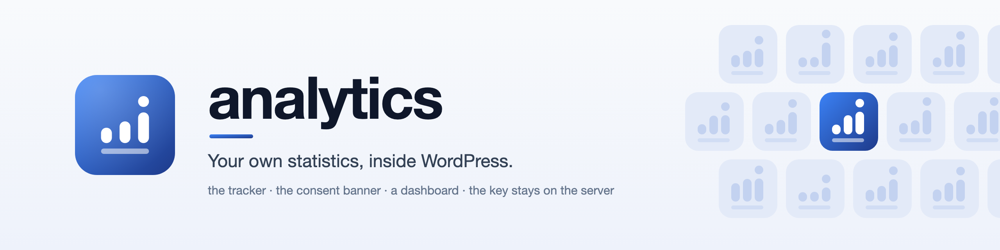
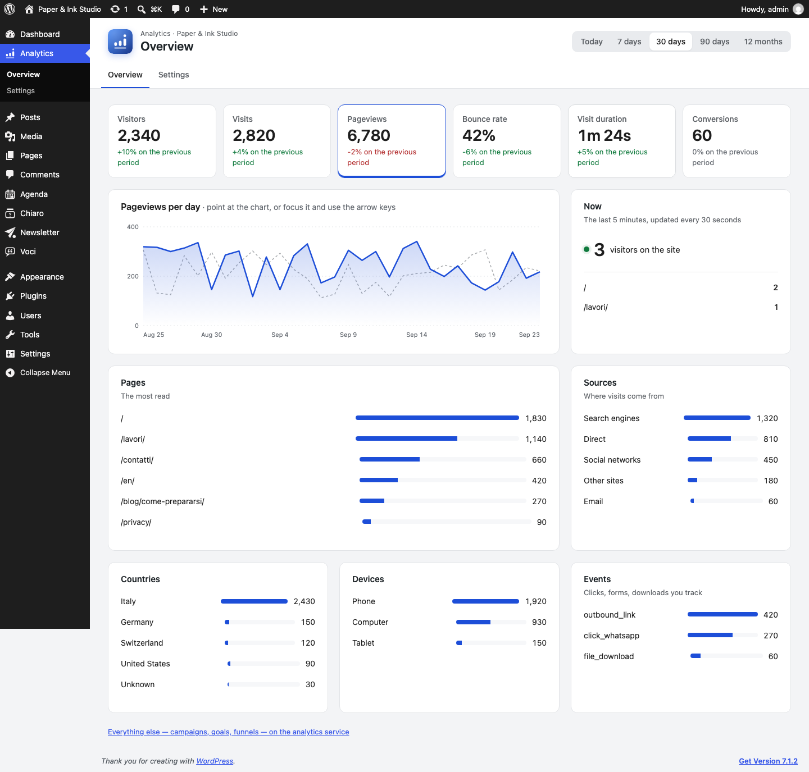
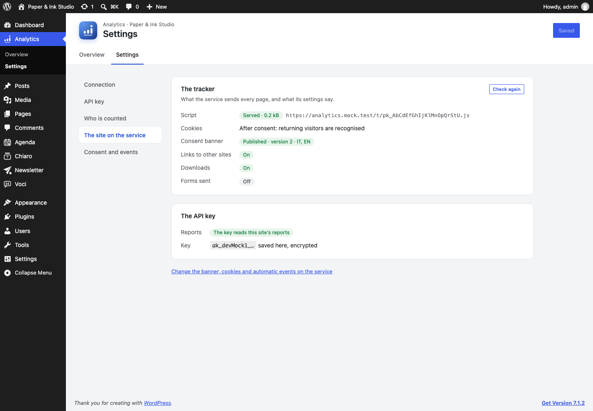
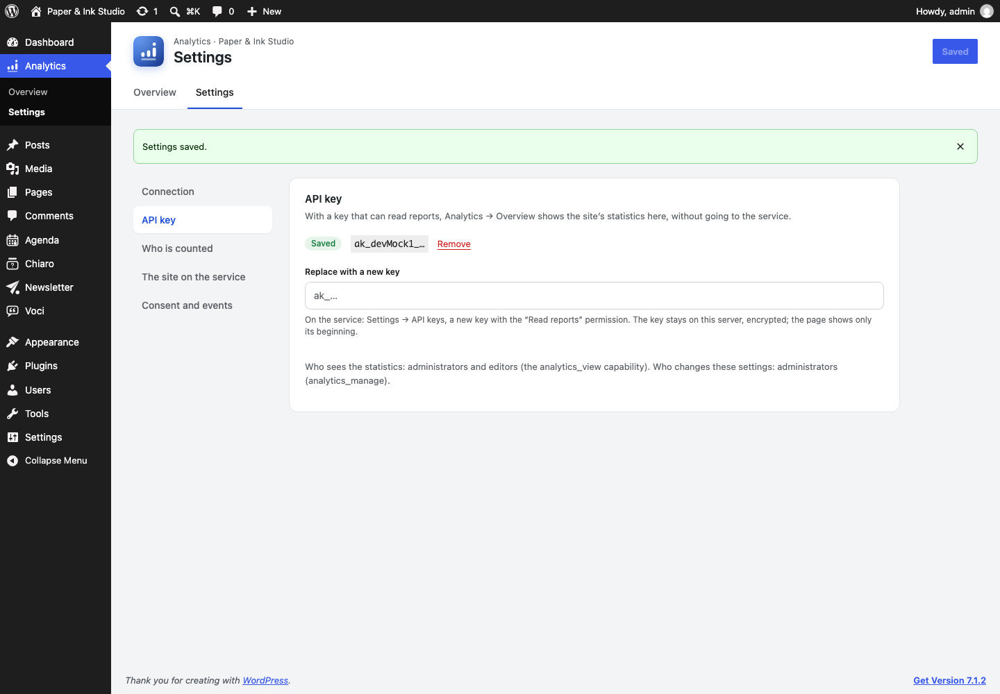

<picture>
  <source media="(prefers-color-scheme: dark)" srcset=".github-assets/banner-dark.png">
  
</picture>

<p align="center">
  <a href="https://github.com/manuto276/analytics/releases?q=wordpress-plugin"></a>
  
  
  
</p>

The WordPress side of [analytics](../../../README.md), the self-hosted, privacy-first
analytics service in this repository. It loads the tracker and its consent banner on every
page, and shows the site's statistics in WordPress, so the people who write the site see
who reads it without another login.

**Nothing is stored in WordPress.** The visits, the consent and the numbers live on your
service. With an API key that can read reports, WordPress asks the service for them
server-side. The key stays on the server, encrypted, and the browser never receives it.

<table>
  <tr>
    <td colspan="2"></td>
  </tr>
  <tr>
    <td colspan="2" align="center"><sub>Overview: the period in numbers, one of them over time, where visits come from, what they read, who is on the site now</sub></td>
  </tr>
  <tr>
    <td></td>
    <td></td>
  </tr>
  <tr>
    <td align="center"><sub>Settings: what the service sends, and whether the key works</sub></td>
    <td align="center"><sub>The API key: pasted once, then shown only by its beginning</sub></td>
  </tr>
</table>

## Features

- **The tracker on every page.** It goes in the `<head>` with `defer`, whatever the
  theme or page builder. It loads from the service or through a path of your own domain.
  Logged-in staff are not counted.
- **A dashboard in WordPress.** Analytics → Overview covers:
  - visitors, visits, pageviews, bounce rate, visit duration and conversions, against the
    previous period;
  - a chart you can read with the keyboard;
  - pages, sources, countries, devices and events;
  - realtime.

  A widget on the WordPress dashboard shows visitors today and over 7 days.
- **Settings on a screen of their own.**
  - The connection.
  - The API key, stored encrypted, or in `wp-config.php`.
  - Who is not counted.
  - A check of what the service sends: the script, the cookie level, the published
    consent banner, the automatic events.
- **Who sees what.** `analytics_view` (administrators and editors) sees the numbers.
  `analytics_manage` (administrators) changes the settings.
- **Consent links.** A block, `[analytics_consent_link]` and a menu link to
  `#analytics-consent` reopen the banner.
- **Server-side conversions.** `analytics_connector_track_conversion( 'purchase', … )`
  sends what happens after the page: payments, confirmed bookings.
- **Italian**, as well as English.

## Install

Download `analytics-connector-<version>.zip` from the
[releases](https://github.com/manuto276/analytics/releases?q=wordpress-plugin) and upload
it from Plugins → Add New → Upload. Then:

1. Analytics → Settings → Connection: the service's address and the site's public key (`pk_…`).
2. On the service, Settings → API keys: a new key with **Read reports**. Add **Write
   conversions** too if WordPress will send conversions.
3. Analytics → Settings → API key: paste it. Or keep it out of the database:
   `define( 'ANALYTICS_CONNECTOR_API_KEY', 'ak_…' );` in `wp-config.php`.

A site running the older "Analytics Connector" updates in place: same folder, same settings.

## For developers

- `analytics_connector_track_conversion( string $name, array $args = [] ): bool`: see
  [`readme.txt`](readme.txt) for the arguments.
- The filter `analytics_connector_content_key` sets a page's content key (for example
  `author:42`).
- The admin screens read `analytics-connector/v1/admin/reports/{name}`. It is a whitelist
  of reports and parameters, and it proxies the service's
  `/api/v1/server/sites/{pk}/reports/{name}` with a 60-second cache.
- The integration guide for the whole service is
  [`docs/integration/wordpress.md`](../../../docs/integration/wordpress.md).

## Design

The icon is the service's own mark
([`docs/assets/brand/mark.svg`](../../../docs/assets/brand/mark.svg)) in white on the
family's tile. The sources are in [`design/`](design); the notes are in
[`docs/icon.md`](docs/icon.md).

## Develop

```sh
npm install && npm start    # rebuilds build/ on change
bin/make-i18n.sh            # languages/: the .pot, and the .mo/.json of every .po
bin/build-zip.sh            # dist/analytics-connector-<version>.zip
node bin/export-assets.mjs  # design/*.svg → the PNG icons and banners
composer install && vendor/bin/phpcs
```

Unit tests (Brain Monkey) and a real-WordPress smoke test run from the repository root:
`make test-wordpress`.

The end-to-end test runs on the WordPress workspace's dev site (http://localhost:8090,
which mounts this folder). There, `dev/mu-plugins/analytics-mock.php` stands in for the
service:

```sh
npm run test:e2e            # setup, the key, the Overview, refusals, an editor, Italian, axe
```

## Layout

```
analytics-connector.php   bootstrap: constants, includes, every hook
uninstall.php             removes the settings, the key and the capabilities
includes/
  settings.php            the option, its sanitising; capabilities
  frontend.php            the tracker, the content key, the consent links
  conversions.php         server-side conversions
  secrets.php             the API key: wp-config.php, or encrypted in the database
  client.php              WordPress → the service: reports, whitelisted and cached
  status.php              the tracker's configuration, the key's check
  rest-admin.php          analytics-connector/v1/admin
  admin-app.php           the menu, the React app, the dashboard widget
blocks/consent-link/      the "Consent settings link" block
src/                      React admin screens → build/
languages/                .pot, Italian
design/                   SVG sources of the icon and banners
tests/                    Unit/ (PHPUnit), smoke/ (real WordPress), e2e/ (Playwright)
```
